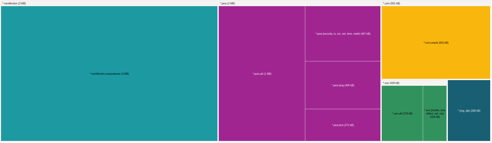
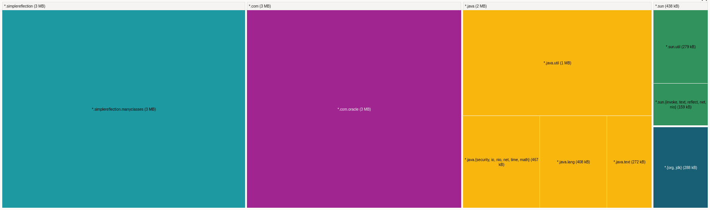
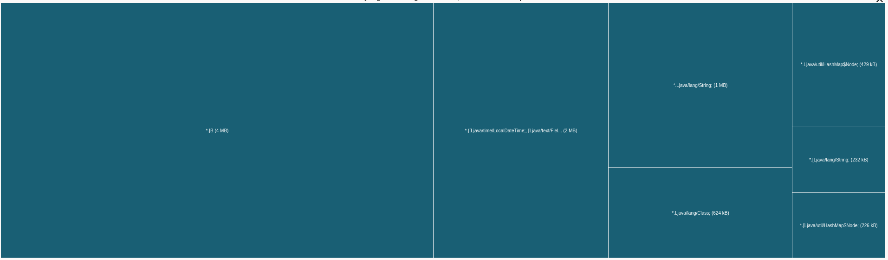
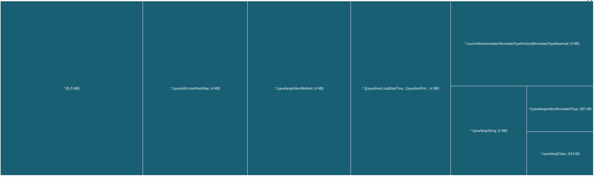

# Graal native-image experiments

All experiments have been done
with `GraalVM 22.0.0.2 Java 17 CE (Java Version 17.0.2+8-jvmci-22.0-b05)`

## Learnings

* Image size doesn't increase when including some methods called through reflection
    * Compare `no-reflection` and `simple-reflection`
    * But beware when there are many classes with many methods called through reflection,
      see `no-reflection-many-big-classes` vs `simple-reflection-many-big-classes` below
* Image size increases a bit when including reflection query data
    * Compare `simple-reflection` and `reflection-query`
    * This amounts to 256 KB executable size when including reflection query data for 100
      classes with 1 constructor and 100 methods each (10100 methods in total)
* If only reflection querying is used and not invocation, native-image is clever enough to
  only include the reflection metadata and not the code for the reflected class/method
    * Search for `HelloWorldPrinter` in "Used Classes" report from Graal
      in `reflection-query-only`
* Using reflection with a small number (~100-200) of called methods (constructors count,
  too) doesn't matter that much
    * The base infrastructure used by native-image dominates the executable size
* Using reflection with a big number (>= 10000) of called methods increases the executable
  size
    * The code region grows a little (Graal includes the `ReflectionAccessorHolder` in the
      executable)
    * The heap region of the executable grows faster than the code region. This is the
      most dominant factor of the executable size
* When using many classes (100) with many methods each (100), the reflection based
  executable is twice as big as the one without reflection
    * Compare `no-reflection-many-big-classes` with `simple-reflection-many-big-classes`:
      15,6 MB vs 31,0 MB
* When including reflection invoke in `reflect-config.json` for methods which are not
  called at runtime, native-image adds the code to the executable
    * This was expected and can bloat the executable with dead code
* When using reflection, minimizing the reflectifly called elements (methods /
  constructors) improves the executable size
    * Bigger classes with more methods are better than small classes with less methods,
      because every class has a constructor, which counts towards the executable size
    * Compare `simple-reflection-many-big-classes` and `simple-reflection-10000-classes`

## Analysis of executable size

You can use the [GraalVM dashboard](https://www.graalvm.org/dashboard/?ojr=dashboard) to
analyze the contents of an executable. This dashboards reads a `bgv` file, which can be
generated in the native build using
the `-H:DashboardDump=filename -H:+DashboardHeap -H:+DashboardCode` parameters.

### no-reflection-many-big-classes vs simple-reflection-many-big-classes

`no-reflection-many-big-classes`:

```
   7,14MB (41,50%) for code area:   17.375 compilation units
   8,26MB (47,99%) for image heap:   1.733 classes and 111.656 objects
   1,81MB (10,50%) for other data
  17,21MB in total
  
Top 10 packages in code area:                               Top 10 object types in image heap:
   3,01MB noreflection.manyclasses.big.classes                 3,21MB byte[] for general heap data
 634,03KB java.util                                            1,09MB java.lang.String
 310,50KB java.lang                                          657,67KB byte[] for java.lang.String
 265,80KB java.text                                          609,64KB java.lang.Class
 235,43KB java.util.regex                                    418,97KB java.util.HashMap$Node
 200,68KB com.oracle.svm.jni                                 226,73KB java.lang.String[]
 176,75KB java.util.concurrent                               220,47KB java.util.HashMap$Node[]
 143,38KB java.math                                          154,69KB java.util.concurrent.ConcurrentHashMap$Node
 125,85KB noreflection.manyclasses.big                       143,73KB char[]
 120,52KB com.oracle.svm.core.reflect                        139,85KB sun.util.locale.LocaleObjectCache$CacheEntry
      ... 116 additional packages                                 ... 764 additional object types  
```

`simple-reflection-many-big-classes`:

```
   8,88MB (25,92%) for code area:   27.477 compilation units
  21,91MB (63,99%) for image heap:   1.733 classes and 324.067 objects
   3,45MB (10,08%) for other data
  34,24MB in total
  
Top 10 packages in code area:                               Top 10 object types in image heap:
   3,01MB simplereflection.manyclasses.big.classes             3,75MB java.util.LinkedHashMap
   1,89MB com.oracle.svm.core.reflect                          3,74MB byte[] for general heap data
 634,11KB java.util                                            3,70MB java.lang.reflect.Method
 312,30KB java.lang                                            2,50MB s.r.a.AnnotatedTypeFactory$AnnotatedTypeBaseImpl
 265,80KB java.text                                            1,40MB java.lang.String
 235,43KB java.util.regex                                      1,18MB byte[] for java.lang.String
 200,68KB com.oracle.svm.jni                                 641,77KB java.lang.reflect.AnnotatedType[]
 176,75KB java.util.concurrent                               609,64KB java.lang.Class
 143,38KB java.math                                          418,97KB java.util.HashMap$Node
  94,21KB java.util.logging                                  343,15KB java.lang.Class[]
      ... 116 additional packages                                 ... 764 additional object types  
```



The no reflection version contains 3 MB of our code, and 931 KB of `com.oracle` code, which is GraalVM specific code.



The reflection version contains the same 3 MB of our code, but the `com.oracle` code is much bigger (3 MB vs. 931 KB). When digging deeper into this package,
we find 2 MB of `com.oracle.svm.core.reflect` code, which is only 123 KB in size in the `no-reflection-many-big-classes` dump. The majority of this 2 MB is
`ReflectionAccessorHolder`, which is the code Graal generates for reflection access.



This image shows a visualization of the heap contents which are embedded in the executable.



When comparing the reflection heap with the no reflection heap, we can see that it's a lot bigger. That's the main reason
why the reflection image is bigger. We can see 4 MB of `LinkedHashMap`, which is not in the no reflection version. Another
4 MB of the heap is used for `reflect.Method`, which is also not there in the no reflection version. Another 3 MB are spent
for `sun.reflect.annotation` data, which is also not in the no reflection version.

### no-reflection-many-classes vs simple-reflection-many-classes

`no-reflection-many-classes`:

```
   4,01MB (33,46%) for code area:    7.475 compilation units  
   6,93MB (57,82%) for image heap:   1.733 classes and 91.653 objects
   1,04MB ( 8,72%) for other data
  11,98MB in total

Top 10 packages in code area:                               Top 10 object types in image heap:
 634,10KB java.util                                            1,77MB byte[] for general heap data
 310,51KB java.lang                                          800,09KB java.lang.String
 265,80KB java.text                                          609,64KB java.lang.Class
 235,43KB java.util.regex                                    494,10KB byte[] for java.lang.String
 200,68KB com.oracle.svm.jni                                 418,97KB java.util.HashMap$Node
 176,75KB java.util.concurrent                               220,47KB java.util.HashMap$Node[]
 143,38KB java.math                                          154,69KB java.util.concurrent.ConcurrentHashMap$Node
 120,52KB com.oracle.svm.core.reflect                        148,62KB java.lang.String[]
  94,21KB java.util.logging                                  143,73KB char[]
  92,03KB java.util.stream                                   139,85KB sun.util.locale.LocaleObjectCach
      ... 116 additional packages                                 ... 764 additional object types  
```

`simple-reflection-many-classes`:

```
   4,04MB (33,54%) for code area:    7.677 compilation units
   6,93MB (57,52%) for image heap:   1.733 classes and 96.068 objects
   1,08MB ( 8,94%) for other data
  12,05MB in total

Top 10 packages in code area:                               Top 10 object types in image heap:
 634,11KB java.util                                            1,78MB byte[] for general heap data
 312,30KB java.lang                                          806,47KB java.lang.String
 265,80KB java.text                                          609,64KB java.lang.Class
 235,43KB java.util.regex                                    505,77KB byte[] for java.lang.String
 200,68KB com.oracle.svm.jni                                 418,97KB java.util.HashMap$Node
 176,75KB java.util.concurrent                               220,47KB java.util.HashMap$Node[]
 158,80KB com.oracle.svm.core.reflect                        154,69KB java.util.concurrent.ConcurrentHashMap$Node
 143,38KB java.math                                          150,20KB java.lang.String[]
  94,21KB java.util.logging                                  143,73KB char[]
  92,03KB java.util.stream                                   139,85KB sun.util.locale.LocaleObjectCache$CacheEntry
      ... 116 additional packages                                 ... 764 additional object types
```

The images are of the same size, as the generated reflection code from Graal for 100
methods (100 classes with 1 method each) isn't that much compared the base infrastructure
which is included in every executable.

### no-reflection and no-reflection-many-classes

Question: Why are the two executables nearly the same size (11,91 MB vs 11,98 MB)?

`no-reflection`:

```
   3,97MB (33,33%) for code area:    7.374 compilation units
   6,91MB (58,05%) for image heap:   1.634 classes and 90.749 objects
   1,03MB ( 8,61%) for other data
  11,91MB in total

Top 10 packages in code area:                               Top 10 object types in image heap:
 634,03KB java.util                                            1,75MB byte[] for general heap data
 310,51KB java.lang                                          790,63KB java.lang.String
 265,80KB java.text                                          587,21KB java.lang.Class
 235,43KB java.util.regex                                    487,24KB byte[] for java.lang.String
 200,68KB com.oracle.svm.jni                                 418,97KB java.util.HashMap$Node
 176,75KB java.util.concurrent                               220,47KB java.util.HashMap$Node[]
 143,38KB java.math                                          154,69KB java.util.concurrent.ConcurrentHashMap$Node
 120,56KB com.oracle.svm.core.reflect                        147,02KB java.lang.String[]
  94,21KB java.util.logging                                  143,73KB char[]
  92,03KB java.util.stream                                   139,85KB sun.util.locale.LocaleObjectCache$CacheEntry
      ... 114 additional packages                                 ... 764 additional object types
```

`no-reflection-many-classes`:

```
   4,01MB (33,46%) for code area:    7.475 compilation units  
   6,93MB (57,82%) for image heap:   1.733 classes and 91.653 objects
   1,04MB ( 8,72%) for other data
  11,98MB in total

Top 10 packages in code area:                               Top 10 object types in image heap:
 634,10KB java.util                                            1,77MB byte[] for general heap data
 310,51KB java.lang                                          800,09KB java.lang.String
 265,80KB java.text                                          609,64KB java.lang.Class
 235,43KB java.util.regex                                    494,10KB byte[] for java.lang.String
 200,68KB com.oracle.svm.jni                                 418,97KB java.util.HashMap$Node
 176,75KB java.util.concurrent                               220,47KB java.util.HashMap$Node[]
 143,38KB java.math                                          154,69KB java.util.concurrent.ConcurrentHashMap$Node
 120,52KB com.oracle.svm.core.reflect                        148,62KB java.lang.String[]
  94,21KB java.util.logging                                  143,73KB char[]
  92,03KB java.util.stream                                   139,85KB sun.util.locale.LocaleObjectCach
      ... 116 additional packages                                 ... 764 additional object types  
```

The executable sizes are almost the same, as the base infrastructure needed for a
native-image just shadows the little bit of code which is needed for the classes
in `no-reflection-many-classes`.

### simple-reflection-many-big-classes vs simple-reflection-10000-classes

`simple-reflection-many-big-classes` (100 classes with 100 methods each):

```
   8,88MB (25,92%) for code area:   27.477 compilation units
  21,91MB (63,99%) for image heap:   1.733 classes and 324.067 objects
   3,45MB (10,08%) for other data
  34,24MB in total
  
Top 10 packages in code area:                               Top 10 object types in image heap:
   3,01MB simplereflection.manyclasses.big.classes             3,75MB java.util.LinkedHashMap
   1,89MB com.oracle.svm.core.reflect                          3,74MB byte[] for general heap data
 634,11KB java.util                                            3,70MB java.lang.reflect.Method
 312,30KB java.lang                                            2,50MB s.r.a.AnnotatedTypeFactory$AnnotatedTypeBaseImpl
 265,80KB java.text                                            1,40MB java.lang.String
 235,43KB java.util.regex                                      1,18MB byte[] for java.lang.String
 200,68KB com.oracle.svm.jni                                 641,77KB java.lang.reflect.AnnotatedType[]
 176,75KB java.util.concurrent                               609,64KB java.lang.Class
 143,38KB java.math                                          418,97KB java.util.HashMap$Node
  94,21KB java.util.logging                                  343,15KB java.lang.Class[]
      ... 116 additional packages                                 ... 764 additional object types  
```

`simple-reflection-10000-classes` (10000 classes with 1 method each):

```
  10,84MB (19,44%) for code area:   37.377 compilation units
  38,88MB (69,72%) for image heap:  11.633 classes and 623.962 objects
   6,05MB (10,85%) for other data
  55,77MB in total

Top 10 packages in code area:                               Top 10 object types in image heap:
   3,86MB com.oracle.svm.core.reflect                          5,57MB java.util.LinkedHashMap
   3,01MB simplereflection.classes10k.classes                  4,75MB byte[] for general heap data
 634,03KB java.util                                            3,70MB s.r.a.AnnotatedTypeFactory$AnnotatedTypeBaseImpl
 312,30KB java.lang                                            3,70MB java.lang.reflect.Method
 265,80KB java.text                                            3,21MB java.lang.reflect.Constructor
 235,43KB java.util.regex                                      2,79MB java.lang.Class
 200,68KB com.oracle.svm.jni                                   2,34MB byte[] for java.lang.String
 176,75KB java.util.concurrent                                 2,30MB java.lang.String
 143,38KB java.math                                            1,38MB com.oracle.svm.core.hub.DynamicHub$ReflectionData
  94,21KB java.util.logging                                    1,23MB java.lang.reflect.AnnotatedType[]
      ... 116 additional packages                                 ... 764 additional object types
```

We can see that the 10000 classes has a bigger executable,
and `com.oracle.svm.core.reflect`, which holds the `ReflectiveAccessorHolder` classes, is
twice the size compared to `simple-reflection-many-big-classes`. I guess the reason is
that, even that the method count of the print methods stays the same (100 classes a 100
methods vs 10000 classes a 1 method), the number of constructors is bigger (100
constructors vs 10000 constructors). You can see that the `java.lang.reflect.Constructor`
takes 3,21 MB of image heap.

This answers the question of "Which is better? Many small classes or few big classes?" -
few big classes are better if they are used via reflection, as this minimizes the number
of constructor reflection data.

## Open experiments

